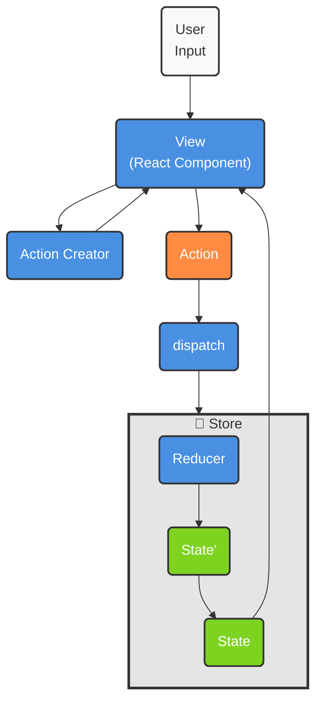

# Redux Counter App Tutorial

Reduxを学習するためのシンプルなカウンターアプリケーションです。こちらの[ShinさんのYouTube動画](https://www.youtube.com/watch?v=KuRu5wOyY_c)を参考に作りました。

## 🚀 機能

- ➕ カウンターの増加
- ➖ カウンターの減少
- 🔢 任意の数値でカウンターを増加

## 🛠 技術スタック

- **React** - UI構築
- **Redux Toolkit** - 状態管理
- **React-Redux** - ReactとReduxの連携

## 📁 プロジェクト構造

```
src/
├── App.js              # メインコンポーネント
├── redux/
│   ├── store.js        # Reduxストア設定
│   └── counterSlice.js # カウンター用Slice
└── App.css
```

## 🔄 Reduxのデータフロー



上の図で示されているように、Reduxは以下のような一方向のデータフローに従います：

1. **User Input** → ユーザーがUIで操作（ボタンクリックなど）
2. **View** → React コンポーネント（App.js）
3. **Action Creator** → アクションを生成（`increment`, `decrement`など）
4. **Action** → 実際のアクションオブジェクト
5. **dispatch** → アクションをストアに送信（`useDispatch`）
6. **Store** → アプリケーションの状態を管理
7. **Reducer** → アクションに基づいて新しい状態を計算
8. **State'** → 計算された新しい状態
9. **State** → 更新された状態でUIを再レンダリング（`useSelector`）

## 🚀 使用方法

1. プロジェクトをクローン

```bash
git clone <repository-url>
cd redux-counter-app-tutorial
```

2. 依存関係をインストール

```bash
npm install
```

3. 開発サーバーを起動

```bash
npm start
```

4. [http://localhost:3000](http://localhost:3000) でアプリを確認

## 📚 Reduxの学習ポイント

### 1. Slice (counterSlice.js)

```javascript
export const counterSlice = createSlice({
    name: "counter", // Action Creatorのプレフィックス
    initialState: { value: 0 }, // 初期状態
    reducers: { // Reducerと Action Creatorを同時定義
        increment: (state) => {
            state.value += 1;
        },
        decrement: (state) => {
            state.value -= 1;
        },
        incrementByAmount: (state, action) => {
            state.value += action.payload;
        },
    },
});
```

### 2. Store (store.js)

```javascript
export const store = configureStore({
    reducer: {
        counter: counterReducer, // stateのcounterキーに対応
    },
});
```

### 3. React連携 (App.js)

```javascript
// 状態の取得
const count = useSelector((state) => state.counter.value);

// アクションの実行
const dispatch = useDispatch();
dispatch(increment());
```

## 📈 このアプリで学べること

- ✅ Redux Toolkitの基本的な使い方
- ✅ `createSlice`によるボイラープレートの削減
- ✅ `useSelector`と`useDispatch`によるReact連携
- ✅ 単方向データフローの理解
- ✅ Immutableな状態更新（Immerによる）

## 🔗 参考リンク

- [Redux Toolkit 公式ドキュメント](https://redux-toolkit.js.org/)
- [React-Redux 公式ドキュメント](https://react-redux.js.org/)
- [Redux 基本チュートリアル](https://redux.js.org/tutorials/essentials/part-1-overview-concepts)

---

_このプロジェクトは
[Create React App](https://github.com/facebook/create-react-app)
で作成されました。_
